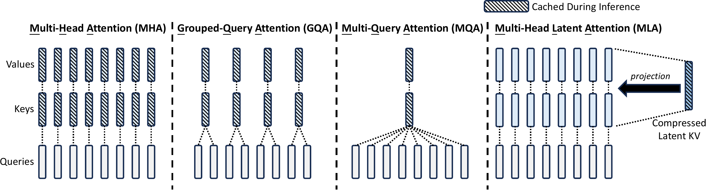
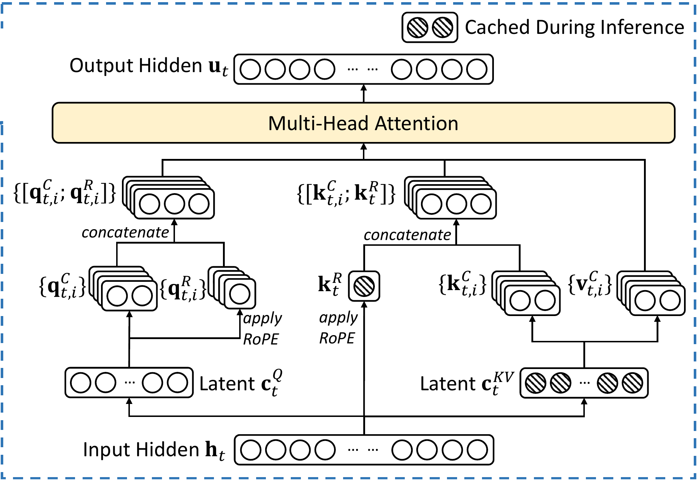

# 00：从 Vanilla Attention 到 MLA

本文是后续 KDA 笔记的前置背景。文档会对每一种机制逐项回答：

本文只讨论 decoder-only LLM 的 causal self-attention。

1. 输入 tensor 是什么 shape？
2. Q、K、V 是什么 shape？
3. attention score 是什么 shape？
4. KV cache 或 recurrent state 保存什么？
5. 哪个典型模型使用它？

## 0. 本文采用的典型模型

| 机制 | 典型来源或模型 | 为什么选它 |
| --- | --- | --- |
| Scaled Dot-Product / MHA | Llama 2 7B | 典型的 decoder-only MHA 模型 |
| MQA | 原始 MQA 论文；Falcon-7B | MQA 原始定义；公开 MQA 大模型实例 |
| GQA | 原始 GQA 论文；Llama 3.1 8B | GQA 原始定义；最典型的现代 GQA 模型之一 |
| Sliding Window Attention | Mistral-7B-v0.1 | 同时使用 GQA 和固定 4096 窗口 |
| MLA | DeepSeek-V2 / DeepSeek-V3 | DeepSeek-V2 提出 MLA；V3 有完整公开配置 |

主要来源：

- [Llama 2 论文](https://arxiv.org/abs/2307.09288)
- [Llama 2 7B 官方配置](https://huggingface.co/meta-llama/Llama-2-7b-hf/blob/main/config.json)
- [Multi-Query Attention 原始论文](https://arxiv.org/abs/1911.02150)
- [Grouped-Query Attention 原始论文](https://arxiv.org/abs/2305.13245)
- [Falcon-7B 官方配置](https://huggingface.co/tiiuae/falcon-7b/blob/main/config.json)
- [Llama 3.1 官方模型卡](https://github.com/meta-llama/llama-models/blob/main/models/llama3_1/MODEL_CARD.md)
- [Llama 3.1 8B 官方配置](https://huggingface.co/meta-llama/Llama-3.1-8B/blob/main/config.json)
- [Mistral-7B 官方配置](https://huggingface.co/mistralai/Mistral-7B-v0.1/blob/main/config.json)
- [DeepSeek-V2 论文](https://arxiv.org/abs/2405.04434)
- [DeepSeek-V3 官方实现](https://github.com/deepseek-ai/DeepSeek-V3/blob/main/inference/model.py)

## 1. 统一 Shape 记号

后面统一使用：

| 符号 | 含义 |
| --- | --- |
| $B$ | batch size |
| $T$ | sequence length，即 token 数 |
| $d_{model}$ | 每个 token 的 hidden-state 维度 |
| $H_q$ | query head 数 |
| $H_{kv}$ | key/value head 数 |
| $D_q,D_k,D_v$ | 每个 head 的 q/k/v 维度 |

在代码中常见两种 layout：

```text
[B, T, H, D]
[B, H, T, D]
```

它们只差一次 transpose。本文写 attention score 时使用 `[B, H, T, D]`，因为矩阵乘法更直观。

### 1.1 `[B,T,D]` 的完整数值例子

设：

```text
B = 2：一个 batch 中有 2 条序列
T = 3：每条序列有 3 个 token
D = 4：每个 token 用 4 个数字表示
```

那么 $X$ 可以是：

$$
X=
\left[
\begin{array}{ccc}
[1,0,0,0]&[0,1,0,0]&[0,0,1,0]\\
[1,1,0,0]&[0,1,1,0]&[0,0,1,1]
\end{array}
\right]
$$

外层两行对应两个 batch item：

```text
X[0]：第 0 条序列，shape [3, 4]
X[1]：第 1 条序列，shape [3, 4]
```

每条序列中有 3 个 token：

```text
X[0, 0] = [1, 0, 0, 0]：第 0 条序列的第 0 个 token
X[0, 1] = [0, 1, 0, 0]：第 0 条序列的第 1 个 token
X[0, 2] = [0, 0, 1, 0]：第 0 条序列的第 2 个 token
```

每个 token 有 4 个 channel，所以：

```text
X[1, 2]    = [0, 0, 1, 1]，shape [4]
X[1, 2, 3] = 1，一个标量
```

三个轴的索引顺序可以记成：

$$
X[\text{第几条序列},\text{第几个 token},\text{第几个 channel}]
$$

`最后一维`指最右侧的 $D=4$ 这一维。

## 2. Vanilla Scaled Dot-Product Attention

### 2.1 先只看一个 head

给定：

$$
Q\in\mathbb R^{B\times T_q\times D_k}
$$

$$
K\in\mathbb R^{B\times T_k\times D_k},\qquad
V\in\mathbb R^{B\times T_k\times D_v}
$$

先计算 score：

$$
L=\frac{QK^\top}{\sqrt{D_k}}
\in\mathbb R^{B\times T_q\times T_k}
$$

再对最后一维做 softmax：

$$
A=\operatorname{softmax}(L)
\in\mathbb R^{B\times T_q\times T_k}
$$

最后：

$$
O=AV\in\mathbb R^{B\times T_q\times D_v}
$$

这里 $A[t,i]$ 是通常所说的“第 $t$ 个 query 对第 $i$ 个 token 的 attention weight”。

### 2.2 “对最后一维做 Softmax”是什么意思

Attention 在 softmax 前已经完成 $QK^\top$。参与 softmax 的 tensor 是 score $L$：

```text
L shape = [B, Tq, Tk]
```

此时最后一维是 $T_k$，表示一个 query 对所有 keys 的分数。

逐元素写成索引公式：

$$
A[b,j,i]
=
\frac{\exp(L[b,j,i])}
{\sum_{r=0}^{T_k-1}\exp(L[b,j,r])}
$$

计算时固定：

- batch 下标 $b$；
- query 下标 $j$。

分母只遍历 key 下标 $r$。因此每个 query 都会独立得到一组对所有 keys 的概率。

给出具体 shape：

```text
B = 2
Tq = 2
Tk = 3
```

假设 scaled score tensor 为：

```text
L shape = [2, 2, 3]

batch 0:
  query 0 scores = [2, 1, 0]
  query 1 scores = [0, 1, 2]

batch 1:
  query 0 scores = [1, 1, 1]
  query 1 scores = [2, 0, 0]
```

执行 `softmax(L, dim=-1)` 后：

```text
A shape = [2, 2, 3]

batch 0:
  query 0 weights = [0.6652, 0.2447, 0.0900]
  query 1 weights = [0.0900, 0.2447, 0.6652]

batch 1:
  query 0 weights = [0.3333, 0.3333, 0.3333]
  query 1 weights = [0.7870, 0.1065, 0.1065]
```

Softmax 只改变数值，shape 保持不变。每一行都满足：

$$
\sum_{i=0}^{T_k-1}A[b,j,i]=1
$$

例如：

$$
0.6652+0.2447+0.0900\approx1
$$

Softmax 会分别处理 $B\times T_q=2\times2=4$ 个长度为 3 的向量。不同 batch 之间不会相互归一化，不同 query 之间也不会相互归一化。

需要特别区分：

```text
hidden state X 的 shape: [B, T, D]，最后一维是 channel D
attention score L 的 shape: [B, Tq, Tk]，最后一维是 key 位置 Tk
```

Attention softmax 作用在 score 的 $T_k$ 维上，使一个 query 对所有可见 keys 的权重和为 1。

### 2.3 一个可以手算的真实数值例子

假设 batch size 为 1，有 3 个 token，每个 head 的维度为 2。只计算第 3 个 token 的 query：

$$
q_3=
\begin{bmatrix}1&0\end{bmatrix}
$$

历史 keys 为：

$$
K=
\begin{bmatrix}
1&0\\
0&1\\
1&1
\end{bmatrix}
$$

values 为：

$$
V=
\begin{bmatrix}
1&0\\
0&2\\
3&1
\end{bmatrix}
$$

原始点积分数是：

$$
q_3K^\top=
\begin{bmatrix}1&0&1\end{bmatrix}
$$

由于 $D_k=2$，scaled scores 为：

$$
\frac{q_3K^\top}{\sqrt2}
\approx
\begin{bmatrix}0.707&0&0.707\end{bmatrix}
$$

softmax 后约为：

$$
a_3\approx
\begin{bmatrix}0.401&0.198&0.401\end{bmatrix}
$$

所以输出是：

$$
o_3=a_3V
\approx
\begin{bmatrix}1.604&0.797\end{bmatrix}
$$

这一步没有“神秘的信息提取”：就是 3 个 value 按 0.401、0.198、0.401 加权求和。

### 2.4 Causal Self-Attention Mask

Self-attention 中，Q、K、V 都来自同一段 hidden states，所以通常 $T_q=T_k=T$。

Causal self-attention 会加入 mask。$T=4$ 时允许读取的位置是：

```text
query 0: [允许, 禁止, 禁止, 禁止]
query 1: [允许, 允许, 禁止, 禁止]
query 2: [允许, 允许, 允许, 禁止]
query 3: [允许, 允许, 允许, 允许]
```

Mask 改变能看哪些位置，但不改变 Q/K/V 的 shape。

### 2.5 $T_q$ 和 $T_k$ 什么时候相等

$T_q$ 表示 query 序列长度，$T_k$ 表示 key/value 序列长度。

#### 场景一：整段 Causal Self-Attention 训练

Q、K、V 都由同一段长度为 $T$ 的 hidden states 生成：

```text
Q: [B, H, T, D]
K: [B, H, T, D]
V: [B, H, T, Dv]
```

因此：

$$
T_q=T_k=T
$$

Causal mask 会限制每个 query 实际能读取的 key 范围，但 score tensor 的逻辑 shape 仍是：

```text
[B, H, T, T]
```

#### 场景二：自回归解码一个新 Token

假设 KV cache 已经保存 1000 个历史 token，现在生成第 1001 个 token。

本轮只为新 token 计算 query：

```text
Q_new: [B, H, 1, D]
```

key/value 包含 1000 个历史位置和 1 个新位置：

```text
K_total: [B, Hkv, 1001, D]
V_total: [B, Hkv, 1001, Dv]
```

因此：

$$
T_q=1,\qquad T_k=1001
$$

score shape 为：

```text
[B, Hq, 1, 1001]
```

这也是 KV cache 能加速解码的原因：历史 token 的 K/V 可以复用，本轮只需计算新 token 的 Q/K/V。

#### 场景三：一次解码多个新 Token

某些 speculative decoding 或 chunked decoding 方法会一次处理 $C$ 个新 token。若历史长度为 $P$：

```text
Q_new:   [B, Hq, C, D]
K_total: [B, Hkv, P + C, D]
scores:  [B, Hq, C, P + C]
```

因此：

$$
T_q=C,\qquad T_k=P+C
$$

chunk 内仍需 causal mask，确保较早的新 token 无法看到较晚的新 token。

可以用一句话记忆：

> $T_q$ 数有多少个位置正在提问，$T_k$ 数有多少个位置可以被查找。

## 3. MHA：Multi-Head Attention

### 3.1 Llama 2 7B 的真实 MHA 配置

Llama 2 7B 使用：

```text
d_model = 4096
Hq = Hkv = 32
Dk = Dv = 128
num_layers = 32
context_length = 4096
```

假设 $B=2,T=1024$，输入为：

```text
X: [2, 1024, 4096]
```

每个 head 都有自己的 Q/K/V projection。概念上，第 $h$ 个 head 使用：

```text
Wq[h]: [4096, 128]
Wk[h]: [4096, 128]
Wv[h]: [4096, 128]
```

实现中通常将 32 组 projection 合成大矩阵：

```text
Wq: [4096, 4096]
Wk: [4096, 4096]
Wv: [4096, 4096]
```

得到：

```text
Q flat: [2, 1024, 4096]
K flat: [2, 1024, 4096]
V flat: [2, 1024, 4096]
```

然后 reshape：

```text
Q: [2, 32, 1024, 128]
K: [2, 32, 1024, 128]
V: [2, 32, 1024, 128]
```

每个 head 独立计算：

```text
scores: [2, 32, 1024, 1024]
head outputs: [2, 32, 1024, 128]
```

最后拼接 32 个 head：

```text
concat: [2, 1024, 32 * 128] = [2, 1024, 4096]
output projection: [2, 1024, 4096]
```

### 3.2 每个 Head 通过 Projection 读取完整 Hidden State

容易误解成：

```text
head 0 只拿 X 的 0:128
head 1 只拿 X 的 128:256
```

这种理解与实际 projection 不符。每个 head 的 projection 都读取完整的 4096 维 $X$，然后各自产生 128 维 q/k/v。投影完成后，输出会 reshape 成 32 个 head。

### 3.3 MHA 的 KV Cache

自回归解码时，只需要为新 token 计算 query，但需要保留所有历史 K/V：

```text
K cache: [B, 32, T_history, 128]
V cache: [B, 32, T_history, 128]
```

每层、每个序列保存的标量数是：

$$
T\times H_{kv}\times(D_k+D_v)
$$

若 $T=4096$、BF16 每个标量 2 bytes，则 Llama 2 7B 每层需要：

$$
4096\times32\times(128+128)\times2
=64\text{ MiB}
$$

32 层合计约 2 GiB。该估算只计算单序列的 K/V tensor，未计入 allocator 对齐和其他运行状态。

MHA 的核心特征是：每个 query head 都有自己独立的 K head 和 V head。

## 4. MQA：Multi-Query Attention

### 4.1 改了什么

MQA 保留多个 query heads，但所有 query heads 共享同一组 K/V：

```text
Hq = H
Hkv = 1
```

因此：

```text
Q: [B, H, T, D]
K: [B, 1, T, D]
V: [B, 1, T, Dv]
```

计算时 K/V 沿 head 维广播给所有 query heads，最终 score 仍然是：

```text
scores: [B, H, T, T]
```

所以 MQA 没有消除 $T\times T$ attention；它主要减少 K/V projection 和 KV cache。

### 4.2 典型模型：Falcon-7B

Falcon-7B 官方配置为：

```text
hidden_size = 4544
num_attention_heads = 71
multi_query = true
head_dim = 4544 / 71 = 64
```

假设 $B=2,T=1024$：

```text
X: [2, 1024, 4544]
Q: [2, 71, 1024, 64]
K: [2, 1, 1024, 64]
V: [2, 1, 1024, 64]
scores: [2, 71, 1024, 1024]
output heads: [2, 71, 1024, 64]
concat: [2, 1024, 4544]
```

对单个序列、$T=2048$、BF16，MQA KV cache 每层约为：

$$
2048\times1\times(64+64)\times2
=0.5\text{ MiB}
$$

Falcon-7B 有 32 层，忽略其他 cache 和开销时约为 16 MiB。若同样配置使用 71 个 KV heads 的 MHA，KV cache 会放大 71 倍。

MQA 的代价是 71 个 query heads 都只能查询同一套 K/V 表示，表示能力可能弱于独立 K/V 的 MHA。

## 5. GQA：Grouped-Query Attention

### 5.1 它是 MHA 与 MQA 的中间点

GQA 使用：

$$
1<H_{kv}<H_q
$$

多个 query heads 组成一组，每组共享一个 K head 和 V head。

### 5.2 典型模型：Llama 3.1 8B

Llama 3.1 8B 的配置为：

```text
d_model = 4096
Hq = 32
Hkv = 8
head_dim = 128
```

每个 KV head 服务：

$$
H_q/H_{kv}=32/8=4
$$

个 query heads。

假设 $B=2,T=1024$：

```text
X: [2, 1024, 4096]
Q flat: [2, 1024, 4096]
K flat: [2, 1024, 1024]
V flat: [2, 1024, 1024]

Q: [2, 32, 1024, 128]
K: [2, 8, 1024, 128]
V: [2, 8, 1024, 128]
scores after grouping/broadcast: [2, 32, 1024, 1024]
output: [2, 1024, 4096]
```

一种常见的连续分组关系是：

```text
query heads  0..3  -> KV head 0
query heads  4..7  -> KV head 1
...
query heads 28..31 -> KV head 7
```

在 128K context、BF16、batch size 1 下，单层 KV cache 为：

$$
131072\times8\times(128+128)\times2
=512\text{ MiB}
$$

Llama 3.1 8B 有 32 层，仅按上述 K/V tensor 估算约 16 GiB。若使用 32 个 KV heads 的 MHA，则是它的 4 倍。

### 5.3 MHA、GQA、MQA 的统一关系

假设都有 32 个 query heads：

| 类型 | $H_q$ | $H_{kv}$ | 每个 KV head 服务多少 Q heads | KV cache 相对大小 |
| --- | ---: | ---: | ---: | ---: |
| MHA | 32 | 32 | 1 | 32 份 |
| GQA | 32 | 8 | 4 | 8 份 |
| MQA | 32 | 1 | 32 | 1 份 |

三者拥有相同的 query 数和最终 score shape，主要差别在于 K/V head 的共享程度。

## 6. Sliding Window Attention：典型模型 Mistral-7B

MHA/MQA/GQA 讨论的是 head 如何共享 K/V。Sliding Window Attention（SWA）讨论的是每个 query 能看哪些 token，是另一个维度的问题。

Mistral-7B-v0.1 的真实配置是：

```text
hidden_size = 4096
Hq = 32
Hkv = 8
head_dim = 128
sliding_window = 4096
```

因此它首先是 GQA：

```text
Q: [B, 32, T, 128]
K: [B, 8, T, 128]
V: [B, 8, T, 128]
```

但第 $t$ 个 query 最多只读取最近 4096 个位置：

```text
allowed keys = [max(0, t - 4095), ..., t]
```

高效 kernel 不需要保存完整 `[B, 32, T, T]` score，可以按窗口处理成近似：

```text
scores: [B, 32, T, 4096]
```

解码时若使用滚动 cache，K/V cache 可以保持：

```text
K cache: [B, 8, 4096, 128]
V cache: [B, 8, 4096, 128]
```

单层、单序列、BF16 约为：

$$
4096\times8\times(128+128)\times2
=16\text{ MiB}
$$

代价是某一层无法直接访问窗口之外的 token。信息只能通过多层传播间接跨越更远距离。

## 7. MLA：Multi-Head Latent Attention

### 7.1 典型来源必须是 DeepSeek

MLA 由 DeepSeek-V2 提出，DeepSeek-V3 延续并公开了完整实现。它先把每个 token 的 K/V 信息压缩成低维 latent，再从 latent 生成各 head 所需的 K/V。这种机制与直接减少 KV head 数有所区别。

下面是 DeepSeek-V2 论文 Figure 3 的原始 MLA 示意图。斜线纹理表示推理期间需要写入 cache 的数据：



图中前三栏展示 MHA、GQA、MQA 分别缓存多少组 Key 和 Value。最右侧的 MLA 先把当前 token 的 K/V 内容压缩为一份 `Compressed Latent KV`，推理时长期缓存这份 latent，使用时再通过 projection 恢复各个 attention head 所需的内容表示。

来源：[DeepSeek-V2 论文](https://arxiv.org/abs/2405.04434) · [原始矢量图 `dsattn.pdf`](paper_sources/deepseek-v2-arxiv-2405.04434/figures/dsattn.pdf) · [原始 `main.tex`](paper_sources/deepseek-v2-arxiv-2405.04434/main.tex) · [完整 arXiv 源码包](paper_sources/deepseek-v2-arxiv-2405.04434/arxiv-source.tar.gz)

#### 7.1.1 MLA 计算流程原图

DeepSeek-V2 论文 Figure 2 还包含一张更详细的 MLA 计算图。下面从原始矢量图中裁出了 MLA 面板，图内内容没有重绘：



按照箭头从下向上阅读：

1. 输入 hidden state 是 $h_t$。
2. 左路把 $h_t$ 下投影成 Query latent $c_t^Q$，再上投影成每个 head 的 $q_{t,i}^C$ 和 $q_{t,i}^R$。
3. $q_{t,i}^R$ 经过 RoPE；它与 $q_{t,i}^C$ 拼接为完整 Query $[q_{t,i}^C;q_{t,i}^R]$。
4. 右路把 $h_t$ 下投影成共享的 KV latent $c_t^{KV}$，再上投影成所有 heads 的 $k_{t,i}^C$ 和 $v_{t,i}^C$。
5. 中路从 $h_t$ 产生共享位置 key $k_t^R$，并对它施加 RoPE。
6. 每个 head 将 $k_{t,i}^C$ 与共享的 $k_t^R$ 拼接为完整 Key $[k_{t,i}^C;k_t^R]$。
7. 完整 Q、K 与 $v_{t,i}^C$ 进入上方的 Multi-Head Attention，得到输出 $u_t$。

上标 `C` 表示 content / NoPE 部分，上标 `R` 表示施加 RoPE 的位置部分。图中的斜线纹理标出了生成阶段需要缓存的两项：$c_t^{KV}$ 和 $k_t^R$。Query latent $c_t^Q$ 只参与当前 token 的计算。

完整原图：[DeepSeek-V2 Figure 2 矢量 PDF](paper_sources/deepseek-v2-arxiv-2405.04434/figures/deepseekv2.pdf)。对应的 LaTeX 引用位于 [`main.tex`](paper_sources/deepseek-v2-arxiv-2405.04434/main.tex)。

### 7.2 DeepSeek-V3 的真实配置

DeepSeek-V3 使用：

```text
d_model = 7168
H = 128
q_lora_rank = 1536
kv_lora_rank = 512
qk_nope_head_dim = 128
qk_rope_head_dim = 64
qk_head_dim = 128 + 64 = 192
v_head_dim = 128
```

字段之间的关系为：

| 字段 | 数值 | 含义 |
| --- | ---: | --- |
| `q_lora_rank` | 1536 | Query 低秩瓶颈维度 |
| `kv_lora_rank` | 512 | K/V 共用的内容 latent 维度 |
| `qk_nope_head_dim` | 128 | 每个 head 中不施加位置编码的 q/k 内容维度 |
| `qk_rope_head_dim` | 64 | 每个 head 中施加 RoPE 的 q/k 位置维度 |
| `qk_head_dim` | 192 | 完整 q/k head 维度，等于 $128+64$ |
| `v_head_dim` | 128 | 每个 value head 的维度 |

### 7.3 这里的 LoRA Rank 表示什么

先看一个普通线性 projection：

$$
y=xW,\qquad W\in\mathbb R^{d_{in}\times d_{out}}
$$

低秩 projection 将大矩阵 $W$ 分解成两个较窄的矩阵：

$$
y=(xW_A)W_B
$$

其中：

$$
W_A\in\mathbb R^{d_{in}\times r},\qquad
W_B\in\mathbb R^{r\times d_{out}}
$$

$r$ 就是 rank 或 bottleneck dimension。中间结果 $xW_A$ 只有 $r$ 维，矩阵乘积 $W_AW_B$ 的秩上限也是 $r$。

DeepSeek 配置沿用了 `lora_rank` 这个命名。它与常见 PEFT LoRA 共享低秩分解的数学结构，但用途有所区别：

- PEFT LoRA 通常给冻结的大模型权重增加一条可训练低秩更新路径，用于微调。
- MLA 的低秩 projection 位于 attention 主计算路径中，从预训练阶段就参与模型训练。
- `q_lora_rank=1536` 控制 Query projection 的瓶颈。
- `kv_lora_rank=512` 控制每个历史 token 写入 KV cache 的内容瓶颈。

以 Query 为例，直接从 7168 投影到 $128\times192=24576$ 需要一个大矩阵：

```text
direct Wq: [7168, 24576]
```

MLA 使用两步：

```text
W_DQ: [7168, 1536]
W_UQ: [1536, 24576]
```

参数量对比：

$$
7168\times24576=176,160,768
$$

$$
7168\times1536+1536\times24576
=48,758,784
$$

`q_lora_rank=1536` 因此同时提供计算瓶颈和参数压缩。Query 只服务当前计算，无需写入 KV cache，所以 q rank 对 cache 大小没有直接影响。

### 7.4 NoPE 与 Partial RoPE

`PE` 表示 positional encoding。`NoPE` 表示某一部分 q/k channel 不施加显式位置编码。

DeepSeek MLA 把每个 192 维 q/k head 分成两个子空间：

```text
content / NoPE part: 128 dimensions
position / RoPE part: 64 dimensions
```

对第 $h$ 个 head：

$$
q_t^{(h)}=
[q_{t,C}^{(h)},q_{t,R}^{(h)}]
$$

$$
k_i^{(h)}=
[k_{i,C}^{(h)},k_{i,R}]
$$

其中：

```text
q_C, k_C: 128 维，保留内容信息，不执行 RoPE
q_R, k_R: 64 维，执行 RoPE，携带相对位置信息
```

DeepSeek MLA 仍然拥有位置感知能力，64 维 RoPE 子空间负责这一部分。`qk_nope_head_dim=128` 只描述 128 维内容子空间。

完整 attention logit 是两部分点积之和：

$$
L_{t,i}^{(h)}=
\frac{
q_{t,C}^{(h)\top}k_{i,C}^{(h)}
+q_{t,R}^{(h)\top}k_{i,R}
}{\sqrt{192}}
$$

第一项负责内容匹配，第二项加入位置信息。

### 7.5 Query 路径的完整 Shape

输入：

```text
X: [B, T, 7168]
```

第一步，下投影到 1536 维 bottleneck：

```text
W_DQ: [7168, 1536]
c_Q = X @ W_DQ: [B, T, 1536]
```

DeepSeek 实现会对 $c_Q$ 做 RMSNorm，然后上投影：

```text
W_UQ: [1536, 128 * 192] = [1536, 24576]
Q_flat = RMSNorm(c_Q) @ W_UQ: [B, T, 24576]
```

拆成 128 个 heads：

```text
Q: [B, 128, T, 192]
```

每个 head 再拆为：

```text
q_nope: [B, 128, T, 128]
q_rope: [B, 128, T, 64]
```

RoPE 只作用于 `q_rope` 的 64 个 channel。

### 7.6 K/V 路径的完整 Shape

K 和 V 共用第一次下投影。该 projection 一次产生 512 维内容 latent 和 64 维位置 key：

```text
W_DKV: [7168, 512 + 64] = [7168, 576]
kv_compressed = X @ W_DKV: [B, T, 576]
```

随后切分：

```text
c_kv:   [B, T, 512]
k_rope: [B, T, 64]
```

$c_{kv}$ 经过 RMSNorm，再上投影成每个 head 的 content key 和 value：

```text
每个 head 需要 128 维 k_nope + 128 维 value = 256 维
128 heads 共需 128 * 256 = 32768 维

W_UKV: [512, 32768]
kv_expanded: [B, T, 32768]
```

reshape 并切分后：

```text
k_nope: [B, 128, T, 128]
V:      [B, 128, T, 128]
```

`k_rope` 每个 token 只有一份：

```text
k_rope physical shape: [B, 1, T, 64]
```

计算 attention 时，它会广播给 128 个 heads。逻辑上的完整 K 为：

```text
K: [B, 128, T, 192]
```

### 7.7 一次完整 MLA Attention 的 Shape

假设 $B=2,T=1024$：

```text
X:        [2, 1024, 7168]
Q:        [2, 128, 1024, 192]
K:        [2, 128, 1024, 192]  # 逻辑 shape
V:        [2, 128, 1024, 128]
scores:   [2, 128, 1024, 1024]
weights:  [2, 128, 1024, 1024]
head out: [2, 128, 1024, 128]
```

128 个 value heads 拼接后：

```text
concat: [2, 1024, 128 * 128] = [2, 1024, 16384]
```

最后经过 output projection：

```text
W_O: [16384, 7168]
output: [2, 1024, 7168]
```

MLA 仍然执行逐历史位置的 full causal attention，逻辑 score shape 依然含有 $T\times T$。

### 7.8 MLA 实际缓存什么

优化推理只缓存下投影结果：

```text
c_kv cache:   [B, T, 512]
k_rope cache: [B, T, 64]
```

Query 当前用完即可释放，无需写入历史 cache。每个历史 token、每层缓存：

$$
512+64=576
$$

个标量。

如果使用相同的 128 heads、K head dim 192、V head dim 128 构造普通 MHA，每个 token 要缓存：

$$
128\times(192+128)=40960
$$

个标量。这组 shape 的缓存元素数量比例约为：

$$
40960/576\approx71.1
$$

以 128K context、BF16、batch size 1 为例，MLA latent cache 每层约：

$$
131072\times576\times2
=144\text{ MiB}
$$

DeepSeek-V3 有 61 层，忽略其他状态约为 8.58 GiB。这个计算用于展示 shape 量级；真实部署还受 cache dtype、并行切分、对齐和实现影响。

### 7.9 Projection Absorption 为什么有效

设内容 key 由 latent 展开得到：

$$
k_{i,C}^{(h)}=W_{UK}^{(h)}c_{i,KV}
$$

内容 attention score 可以重排：

$$
q_{t,C}^{(h)\top}k_{i,C}^{(h)}
=q_{t,C}^{(h)\top}W_{UK}^{(h)}c_{i,KV}
$$

$$
=\left(W_{UK}^{(h)\top}q_{t,C}^{(h)}\right)^\top c_{i,KV}
$$

因此，可以预先变换当前 query，随后直接与缓存的 512 维 $c_{KV}$ 计算内容分数。历史 token 的 128 份 content keys 无需长期保存在显存中。

Value 侧也能利用结合律。若：

$$
v_i^{(h)}=W_{UV}^{(h)}c_{i,KV}
$$

加权求和可以写成：

$$
\sum_i a_{t,i}^{(h)}v_i^{(h)}
=W_{UV}^{(h)}\left(\sum_i a_{t,i}^{(h)}c_{i,KV}\right)
$$

展开矩阵可以继续与 output projection 合并，从而围绕 latent cache 完成优化计算。

RoPE 变换随 token 位置变化，无法完全吸收到固定 projection 矩阵中。DeepSeek MLA 因此为每个历史 token 额外缓存 64 维 $k_{rope}$。

## 8. Full-Attention 变体的横向 Shape 对比

令 query head 数为 $H_q$，KV head 数为 $H_{kv}$：

| 机制 | Q | 实际缓存的 K/V 或 state | 是否有逻辑 $T\times T$ score |
| --- | --- | --- | --- |
| MHA | `[B,Hq,T,D]` | K/V `[B,Hq,T,D]` | 是 |
| MQA | `[B,Hq,T,D]` | K/V `[B,1,T,D]` | 是 |
| GQA | `[B,Hq,T,D]` | K/V `[B,Hkv,T,D]` | 是 |
| MLA | `[B,Hq,T,Dq]` | latent `[B,T,Rkv]` + position part | 是 |
| SWA | 取决于 MHA/GQA | 只保留窗口内 K/V | 只有窗口内 |

一句话区分：

- MHA：每个 Q head 有独立 K/V。
- MQA：所有 Q heads 共用一组 K/V。
- GQA：每组 Q heads 共用一组 K/V。
- MLA：每个历史 token 保存一个低维 latent，需要时供多 heads 使用。
- SWA：只看最近固定数量的历史位置。

下一篇从逐 token KV cache 转向固定大小的 recurrent state：[`01-linear-attention-background.md`](./01-linear-attention-background.md)。
